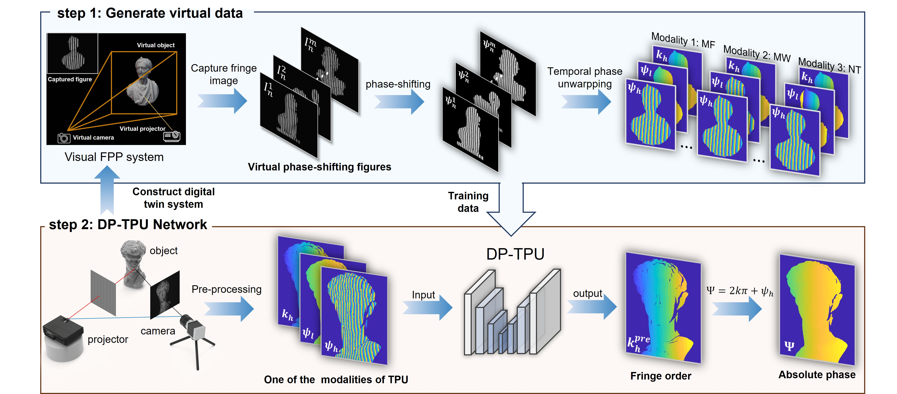
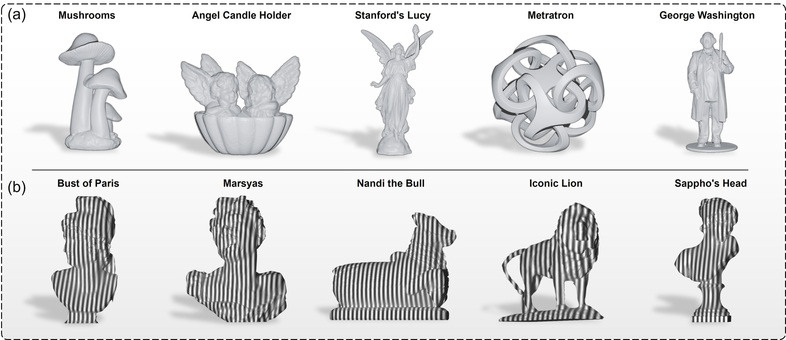
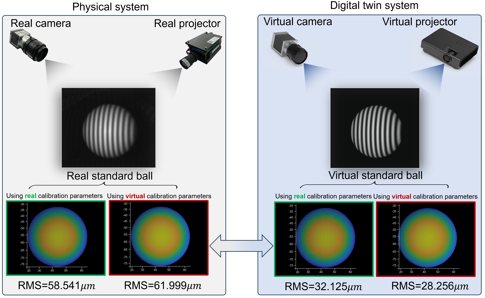

# DP-TPU
This is the code for Digital-Twin-Driven Unambiguous Structured Light 3D Imaging with Physics-Aware Learning.
This repository contains the Blender scene to synthesize training data and to run the fringe-projection pipeline for DP-TPU.


Workflow of the DP-TPU network.

## Blender environment

This code was tested in Blender 4.0.
Since we used the function "Scriping" in Blender, a Python environment is needed.
Run the following command to create the conda environment.
```
conda env create -f environment.yml
```
After that, you need to link this environment to Blender. You can refer to [How to install Python packages for Blender (Pandas)](https://www.youtube.com/watch?v=gyRoY9QUNg0) for a detailed opration.

## Dataset for training
Download the datasets from [Thingi10K](https://github.com/Thingi10K/Thingi10K). After downloading the datasets, place them under `data/models` directory. You can change the path to the dataset in `DP-TPU.blend`.


Representative training 3D models rendered in a single Blender scene.

## How to set your own digital twin FPP system
Due to copyright reasons, we are unable to provide calibration codes. Please comfirm that the variable name(Internal para K and External para R, T) of your clibration parameters is the same as ours. After calibration, place them under `data/calib` directory.
Then, run the matlab script `gre_digital_twin_para.m`. Copy the resulting parameters into the corresponding fields in Blender to complete the digital-twin setup.

## How to use our Blender code
The Blender scene is uploaded in Releases. Please download `DP-TPU.blend` and the code from the repository to obtain the complete code.
We provide several scripts. Open `DP-TPU.blend`, switch to "Scripting" part. 
To apply the resulting parameters to your digital twin system, select the script `apply_calib_to_blender` and click Run.
To generate the chessboard, select the script `generate_chessboard` and click Run.
To generate the calibration images, selcet the script`calibration` and click Run. 
To rectificate the principal point offset and skew factor, selcet the script`rectification_calib` and click Run. 
To generate the synthesis data, sclect `capture_simdata` and click Run.


Cross-reconstruction validation of physical fidelity between the digital twin and real measurement systems.

## How  to execute FPP
After generate synthesis fringe images, you can run `MF_blender.m` and `MW_blender.m` for multi-frequency and multi-wavelength respectively. Due to copyright reasons, we are unable to provide the code for the number-theoretic TPU.
Those codes produce wrapped phases and fringe orders for the rendered data.

## Citation
We will provide the official citation once the paper is published.

## Contact
Please direct questions to yihengliu@njust.edu.cn.


